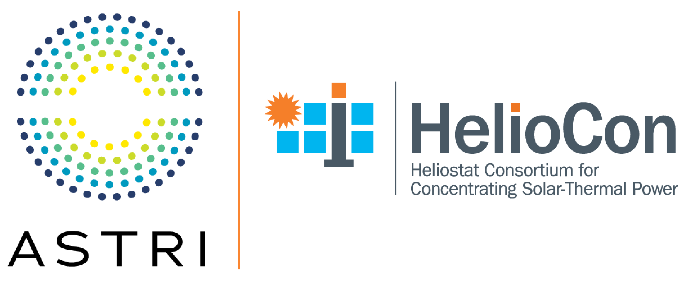

# Mirror Soiling Data
A data repository for soiling of solar mirrors developed as a part of the [Heliostat Consortium (HelioCon)](https://heliocon.org/) and the Australian Solar Thermal Research Institute (ASTRI). At present, only sites from Australia are included. Ongoing experiments will continue to expand the record length and number of locations. 

## Data description
Each folder contains experimental data collected at the named location. The main data files are organized into the following Excel sheets: 
- **Dust** — this sheet contains constant related to local dust characteristics (if available, otherwise taken from literature);
- **Source_Intensity** — has optics data related to the device used to measure the reflectance (D&S reflectometer in most cases);
- **Tilts** — reports the tilt history for each mirror exposed outdoor for the experiments;
- **Reflectance_Average** — reports the sample average of the measured values of reflectance on the mirrors;
- **Reflectance_Sigma** — reports the sample variance of the reflectance measurements on each mirrors (usually 6 to 9 data points are collected on each mirror).

A parameters file is also provided which contains the key parameters needed for modelling with previously published models [1-3], which are available in the [HelioSoil](https://github.com/cholette/HelioSoil) library. 

## Contributing to the database
If you have data that you'd like to contribute to this database, please contact [Michael Cholette](https://www.qut.edu.au/about/our-people/academic-profiles/cholette/) or [Giovanni Picotti](https://www.linkedin.com/in/giovanni-picotti-653011147/).

## Suggested citation

### Plain text
    G. Picotti, M. E. Cholette, C. B. Anderson, T. A. Steinberg, and G. Manzolini, “Stochastic soiling loss models for heliostats in Concentrating Solar Power plants,” Solar Energy, vol. 263, p. 111945, Oct. 2023, doi: 10.1016/j.solener.2023.111945.

### BibTeX
 ~~~bibtex
  @article{picotti_stochastic_2023,
	title = {Stochastic soiling loss models for heliostats in Concentrating Solar Power plants},
	volume = {263},
	doi = {10.1016/j.solener.2023.111945},
	journal = {Solar Energy},
	author = {Picotti, Giovanni and Cholette, Michael E. and Anderson, Cody B. and Steinberg, Theodore A. and Manzolini, Giampaolo},
	month = oct,
	year = {2023}}
  ~~~

## References
[1] G. Picotti, M. E. Cholette, C. B. Anderson, T. A. Steinberg, and G. Manzolini, “Stochastic soiling loss models for heliostats in Concentrating Solar Power plants,” Solar Energy, vol. 263, p. 111945, Oct. 2023, doi: https://doi.org/10.1016/j.solener.2023.111945

[2] G. Picotti, P. Borghesani, G. Manzolini, M. E. Cholette, and R. Wang, “Development and experimental validation of a physical model for the soiling of mirrors for CSP industry applications,” Solar Energy, vol. 173, pp. 1287–1305, 2018, doi: https://doi.org/10.1016/j.solener.2018.08.066.

[3] C. B. Anderson, G. Picotti, M. E. Cholette, B. Leslie, T. A. Steinberg, and G. Manzolini, “Heliostat-field soiling predictions and cleaning resource optimization for solar tower plants,” Applied Energy, vol. 352, p. 121963, Dec. 2023, doi: https://doi.org/10.1016/j.apenergy.2023.121963.

## Acknowledgements

This database was developed with the support of the Australian Government, through the Australian Renewable Energy Agency (ARENA) and within the framework of the Australian Solar Thermal Research Institute (ASTRI). Support for this database has also been provided by the U.S. Department of Energy’s Solar Energy Technologies Office via the Soiling Subtask of the Heliostat Consortium (HelioCon).   

--------------------

